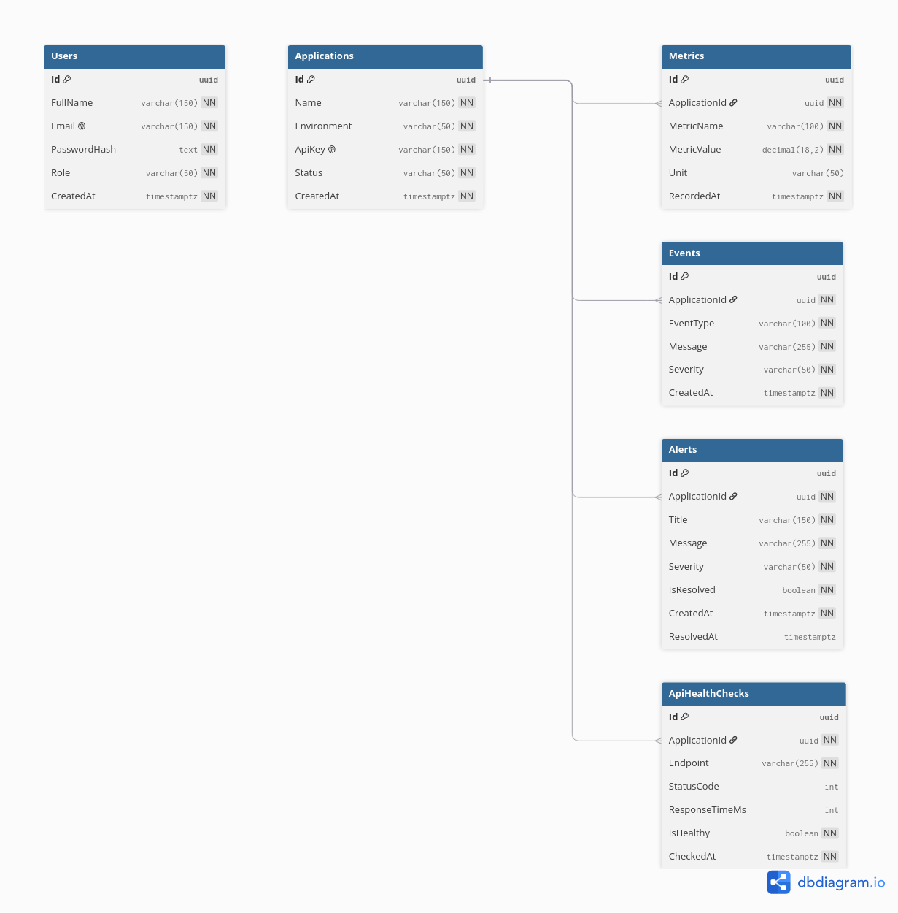

# LiveMetricStack

LiveMetricStack is a real-time business monitoring platform built with ASP.NET Core, SignalR, and PostgreSQL.  
It ingests metrics/events, stores them, runs background analysis (alerts + health checks), and streams live updates to clients over WebSockets.  
The backend is deployed on Render and integrated with a Vercel-hosted frontend.


## Live Deployments

- Backend API (Render): `https://livemetricstack.onrender.com`
- Frontend (Vercel): `https://live-metric-monitor-frontend.vercel.app`

## Architecture

This repo now follows 4-layer Clean Architecture:

1. `Domain` (`LiveMetricStack.Domain`)
2. `Application` (`LiveMetricStack.Application`)
3. `Infrastructure` (`LiveMetricStack.Infrastructure`)
4. `WebApi` (`LiveMetricStack.WebApi`)

Dependency direction:
- `Application` -> `Domain`
- `Infrastructure` -> `Application`, `Domain`
- `WebApi` -> `Application`, `Infrastructure`

## Tech Stack

- ASP.NET Core Web API (`net9.0`)
- EF Core + PostgreSQL (Npgsql)
- JWT auth
- SignalR
- Redis (optional distributed cache)
- React + Tailwind (separate frontend repo/app)

## Current Backend Scope

Implemented endpoints:
- `POST /api/auth/register`
- `POST /api/auth/login`
- `GET /api/applications`
- `GET /api/applications/{id}`
- `POST /api/applications`
- `PATCH /api/applications/{id}/status`
- `POST /api/metrics`
- `GET /api/metrics`
- `GET /api/metrics/{applicationId}/latest`
- `GET /api/dashboard`
- `POST /api/events`
- `GET /api/events`
- `POST /api/alerts`
- `GET /api/alerts`
- `PATCH /api/alerts/{id}/resolve`
- `POST /api/health-checks`
- `GET /api/health-checks`
- `WS /hubs/metrics` (SignalR)

Implemented schema entities:
- `Users`
- `Applications`
- `Metrics`
- `Events`
- `Alerts`
- `ApiHealthChecks`

## Database ER Diagram



Background workers:
- `FakeMetricsWorker` writes demo CPU, memory, request count, and error rate metrics continuously.
- Worker also broadcasts live metric batches to SignalR clients using event: `metrics:batch`.
- Worker writes event records and triggers/resolves high-error alerts.
- `HealthMonitorWorker` runs endpoint probes and stores `ApiHealthChecks`.
- `MetricsRetentionWorker` prunes old metric records by retention policy.

SignalR usage:
- Clients should call `JoinApplication(applicationId)` after connect.
- Clients receive app-scoped metric batches via `metrics:batch`.
- Clients can call `LeaveApplication(applicationId)` when switching context.
- Clients receive alert notifications via `alerts:new` and `alerts:resolved`.

Caching:
- Distributed cache is wired for metrics and dashboard queries.
- Set `Cache:EnableRedis=true` and provide `ConnectionStrings:Redis` to use Redis.
- If Redis is disabled/unavailable, API falls back to in-memory distributed cache.

## Configuration

Edit:
- `LiveMetricStack.WebApi/appsettings.json`
- `LiveMetricStack.WebApi/appsettings.Development.json`

Required keys:
- `ConnectionStrings:PostgreSql`
- `ConnectionStrings:Redis`
- `Jwt:Issuer`
- `Jwt:Audience`
- `Jwt:Key` (minimum 32 characters)
- `Jwt:ExpirationMinutes`
- `MetricsGenerator:*`
- `MetricsRetention:*`
- `HealthMonitor:*`
- `Cache:*`

Notes:
- `Jwt:Key` must be at least 32 characters.
- API accepts both standard Npgsql connection strings and URL-style Postgres strings (`postgres://...`, `postgresql://...`), which works with Render database URLs.
- CORS allowed origins are configured under `Cors:AllowedOrigins`.

### Render Environment Variables (Production)

- `ConnectionStrings__PostgreSql=<Render Internal Database URL>`
- `Jwt__Issuer=LiveMetricStack`
- `Jwt__Audience=LiveMetricStack.Client`
- `Jwt__Key=<long random secret>`
- `Database__ApplyMigrationsOnStartup=true` (first deploy only, then set `false`)
- `Cors__AllowedOrigins__0=https://your-host-url`
- `Swagger__EnabledInProduction=true` (enable Swagger UI on production at `/swagger`)

Generate a JWT key:
```bash
openssl rand -hex 32
```

## Run

1. Restore:
```bash
dotnet restore LiveMetricStack.sln
```

2. Build:
```bash
dotnet build LiveMetricStack.sln
```

3. Run API:
```bash
dotnet run --project LiveMetricStack.WebApi
```

Swagger (Development):
- `https://livemetricstack.onrender.com/swagger`

Health endpoint:
- `/health`

## Next Build Steps

1. Add Docker Compose for PostgreSQL + Redis local stack.
2. Add integration tests for auth, metrics ingestion, and realtime broadcasts.
3. Replace fake metrics with external app ingestion for production-like telemetry.
4. Add richer alert lifecycle (acknowledge/snooze/escalation).
